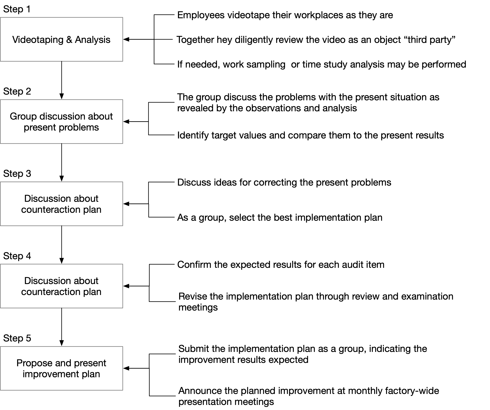
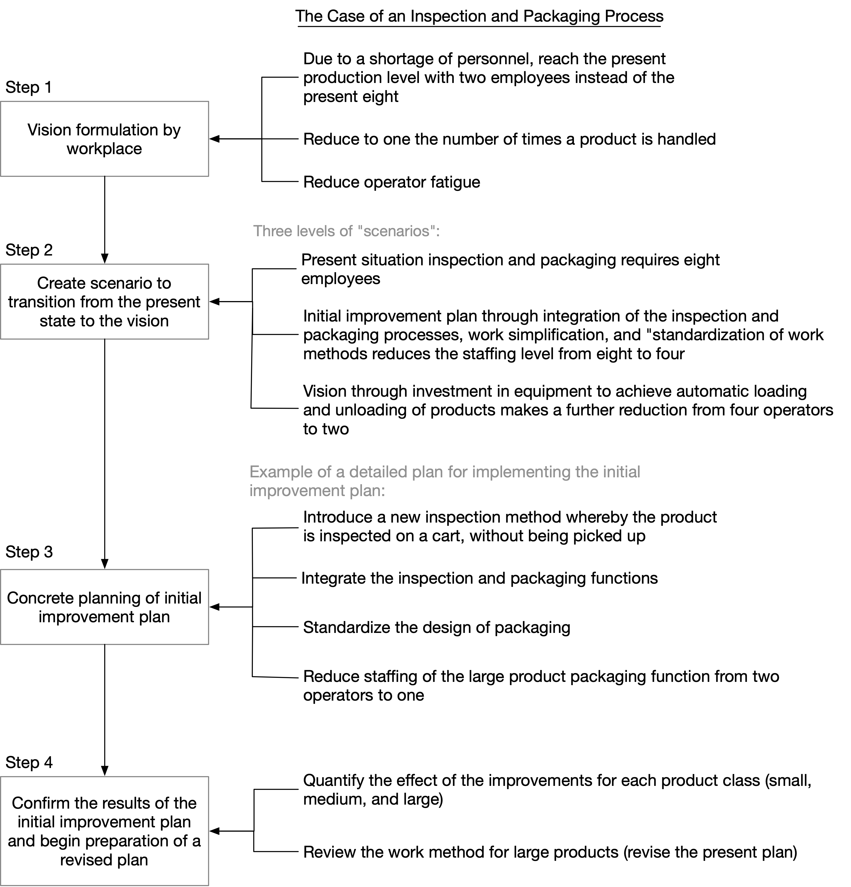

# A Review of Continuous Improvement (Kaizen)

_Continuous improvement_, or _Kaizen_ in Japanese, is **based on a request from top management or a downstream manufacturing group, set up an improvement activity with participation of all employees and perpetually expand this program.**

#### Why We Need Continuous Improvement

**Continuous improvement as it goes, is continuous**

Improvement, without saying, is important for any organization and individual. Continuous improvement emphasizes continuous, which means it's not a spot activity only for a certain period of time. Improvement activities must be established in the workplace with the participation of all members and be expanded and further developed over time.&#x20;

Without "continuous" improvement, organization would likely into a stagnant situation.

**Improvement ideas could be inside and outside the organization, without limit**

Production volume, defects and rework, traditionally speaking, these are things we can work on within a factory. But by changing our perspective or looking from different angle, we can find improvement demands outside the organization, like customers want faster delivery and lower prices.

**Gap between ideal situation and reality**

Ideas are plump, but reality is skinny. There will always have gap between "What you want" and "What you really can achieve", and the higher the level of the ideal image, the bigger the gap between it and reality. Continuous improvement is to eliminate the gap. Even if you think "There is not place we can improve", as above-mentioned, changing perspective can always bring new ideals, hidden losses still exist in most cases.

What I understand continuous improvement, it can be thought of as a body needing periodic checkups for workplace, which helps us to find potential problems are as yet unnoticed. From the results of the checkups, hidden issues can be found and the potential for further improvement can be confirmed.

#### Autonomous Improvement

A core team of continuous improvement engineers is often pursued when a production reengineering program is taken. It's important to have experts to do the job, but production line members can also play an important role here, since they hold many near-at-hand opportunities for improvement.

In order to conduct continuous improvement activities at the workplace in a sound and reliable fashion, the most essential factor is **a sense of involvement on the part of all the members involved**.

#### Potential Problems with Continuous Improvement

Below are some obstacles must be overcome to run an active and successful continuous improvement program.

1. **The attitude that "Our work is being done just find" or "Compared to the past, our work has been greatly improved" leads to the belief that "There is no more room for improvement ".** With this attitude, even if the members were to accept the need for further improvement program, they would not know how to proceed.
2. **A lack of improvement ideas.** Sometimes there is a consciousness of the need to look for waste in the workplace, no one translates that into actual improvement ideas. In particular, the bud of an idea like "This could be changed in this way" is usually nipped by the members themselves, since they immediately start to think of the constraints and assumptions that exist in the present situation, and then into a "That will not work because ..." mind set.
3. **Difficulty on the part of the participants in explaining the essentials of their improvement ideas.** If the content and effect of an improvement idea cannot be effectively explained, even a good idea will not be properly conveyed. The presenter may be told to put the idea in the form of a written improvement proposal, but he or she may not have the skill to do that.
4. **Preoccupation with daily work, leaving participants no time to think about improvements.** Being busy all day in the workplace dealing with routine work, participants have little time to think about improvement proposals. Besides, there is no time to write a proposal document or discuss it in a group.
5. **Lack of pressure to come up with improvements, so no one presents opinions about improvements.** Even if someone has a suggestion for an improvement, neither superiors nor colleagues will routinely ask "What is your opinion?"; therefore, ideas never get expressed. Many operators would offer an opinion if asked, but they do not have the courage to speak out on their own initiative.
6. **Failure of the company to create an atmosphere where improvement proposals are welcomed.** Even if someone makes an improvement proposal, he or she is seldom praised for it.
7. **Slowness in evaluating proposals and reporting management decisions about adopting them.** After submitting a proposal, it takes a long time to get any feedback.
8. **Lack of management interest in improvement proposals or in revising, promoting, or extending them.**
9. **Slowness in implementing ideas or plans.** The preparations for implementation may be troublesome, making the idea work with other process steps may be difficult, and gaining acceptance by other members may take time. For these reasons, the enthusiasm of the proposing member gradually diminishes.
10. **Poor follow-up after implementation -- no one bothers to evaluate or measure the impact of the idea.**

#### Measures for Effective Application of Continuous Improvement

For above-mentioned problems, (1), (2), and (3) can be solved by finding a way to instill in the minds of all employees the attitude: "Let us make our workplace as good as we can!" Here are some concrete examples:

* Holding periodic (e.g., two hours every month) improvement training meetings for all the members, or hold _Kaizen_ week every couple of weeks.
* Holding meetings in which core members of the team conduct practical exercises in how to make improvements.
* Implementing _self-checkups_ in every workplace.
* Posting lists of improvement hints (collections of example of actual improvements) and distributing this information to all members in the form of handouts.
* Holding improvement exhibitions, i.e., displaying actual improvement examples, including photographs, videos, or improved items in the factory lunchroom or in other suitable locations. Sometimes it may be useful also to show examples of unsuccessful attempts.
* Implementing a program of study visits to other workplaces in the company (or a "student exchange" type program, between different areas within the company).
* Holding classes in proposal writing.

In order to solve problems (4) through (10), systems must be created which will fully release the potential capabilities of the members. The following are examples of such systems, which have been effective in practice:

* Include time in each moth's work schedule for group discussion. Every month, at a time when the workload is relatively light (such as the beginning or middle of the month), systematically set aside time for a discussion.&#x20;
* Implement an Idea Submission Day scheme and appoint a person to gather the ideas. This particularly helps reticent members who will give an opinion only when “called upon.”
* Hold Improvement Presentation Meetings each month in each division of the company, attended by top management, other managers, and a representative of each group. These meetings will enable members from one group to learn about the progress of the improvement activities of other groups, and use that information to further improve their own activities.
* Announce the impact of adopted proposals. By displaying improvement results in a form that everyone can see, the members can take pride in saying “I contributed to this improvement!,” which should lead to an eagerness to aim at even higher improvement levels.

#### Example One: Self-checkups Using Videotaping

<figure><figcaption>
Videotape Strategy
</figcaption></figure>

#### Example Two: Steps of Pursuing Vision Strategy

<figure><figcaption>
Vision Strategy
</figcaption></figure>

1. **Explain the goals of the improvement activities, their purpose, and their direction.** The basic corporate policy must be broken down into activities and objectives for each group in the company, and this total strategy must be thoroughly understood by all the employees.&#x20;
2. **Schedule limited time periods for specific activities.** It can be very effective to set fixed time periods for campaigns which focus the knowledge and strength of the members on a certain topic.&#x20;
3. **Define individual steps.** Even if employees have an improvement mind, there may be cases where individuals do not understand their specific roles. Besides, they may struggle as a group, wondering “What is the best way to proceed?” For this reason, the specific steps of each campaign should be clarified.
4. **Create team spirit through a sense of “We’re doing this together.”** Existing group activities, presentation meetings, proposal “exhibitions,” and in-company kaizen study sessions will stimulate others to think: “Look at how active that group is. Let us not get left behind.” This effort results in a synergistic effect and can launch an extraordinary improvement explosion throughout the company.
5. **Establish a system that clearly recognizes people and announces the results of their efforts.** If the benchmarks for improvement results are clear, and actual results show improvements, this increases the confidence of the participants and starts a positive cycle, encouraging members to target the next level. If the results of group activities are fairly evaluated and recognition given in an appropriate and timely way, enthusiasm for improvement activities will surely expand throughout the company.

By fully implementing the above key points, solid results can be achieved, and the resulting pride and satisfaction will spread to all employees.This in turn becomes a major activator, stimulating employees to move on to the next improvement activities.

#### Conclusion

A systematic _kaizen_ program can contribute to increased corporate profits through increased quality which surpasses that of competitors, wide-reaching cost reduction, and dramatic reduction in delivery time. In today’s competitive environment, it is more important than ever that all employees of manufacturing companies not only perform conscientiously the work they have been given but also actively participate in kaizen activities.

It is also true that “The more outstanding the company is, the more aggressively they pursue _kaizen_.” As a result, in the future, the gap between the outstanding companies and those satisfied with the status quo will continue to widen.

In the future, also, it will remain true that “For every employee, _kaizen_ ideas are unlimited.”

***

Reference: _Maynard's Industrial Engineering Handbook, chap 4.2_
